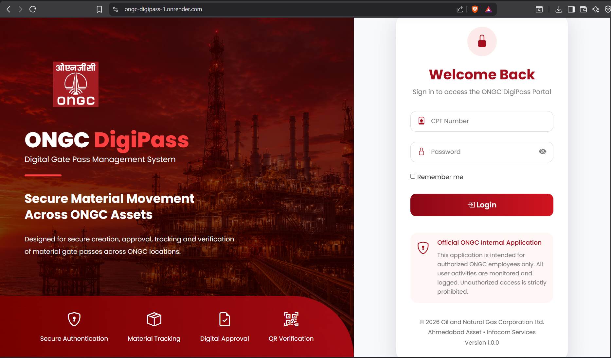
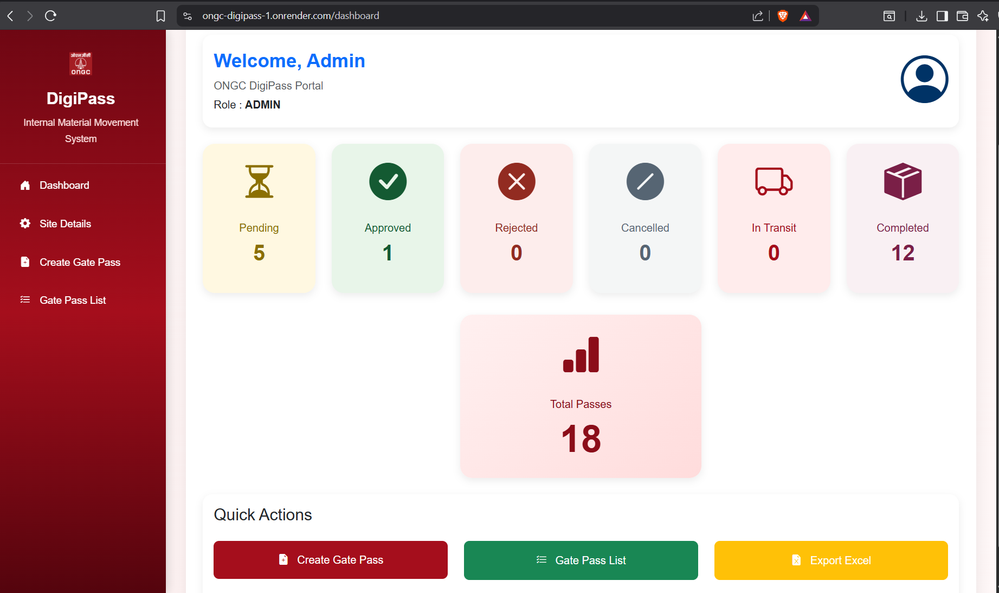
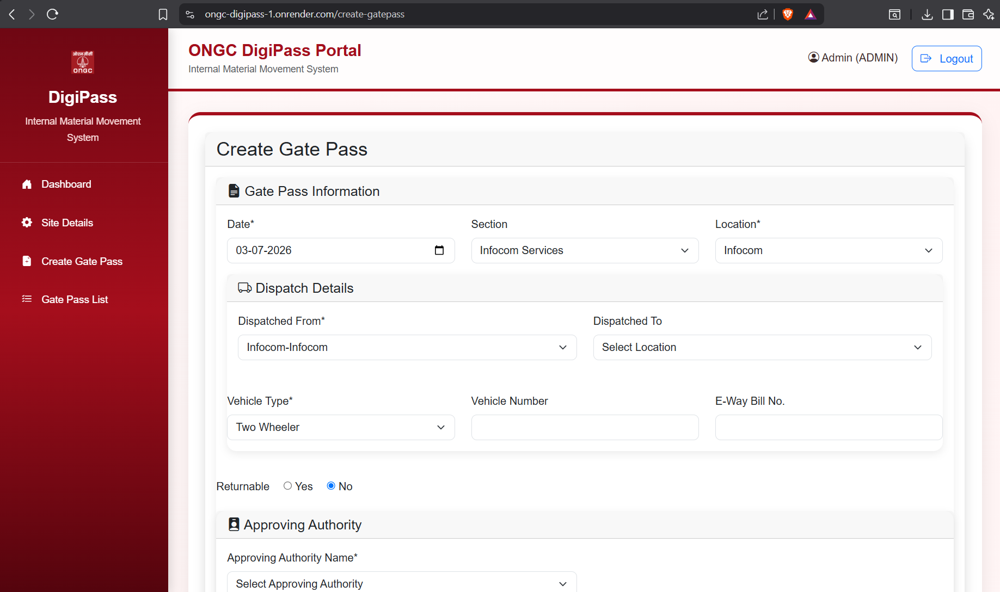
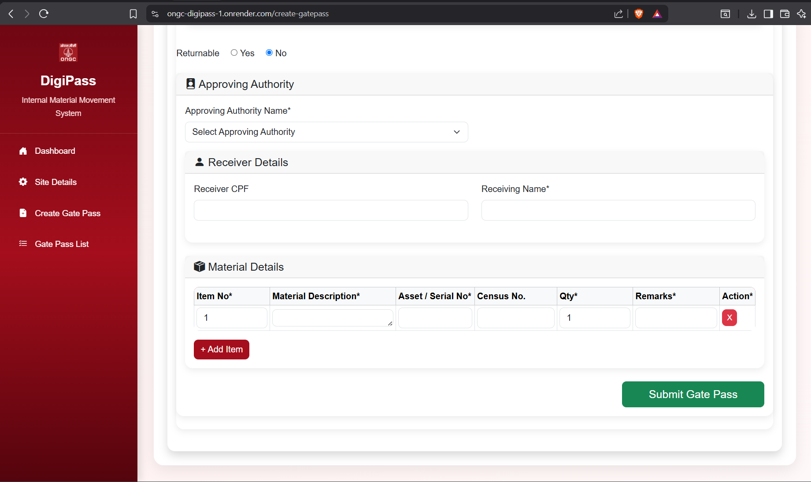
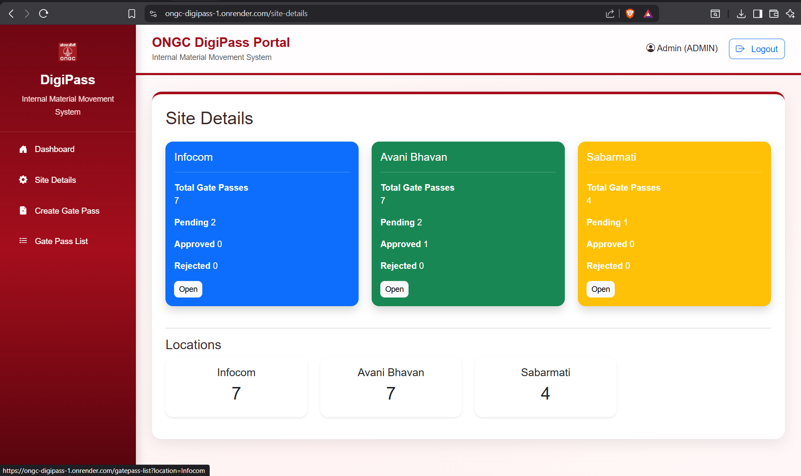
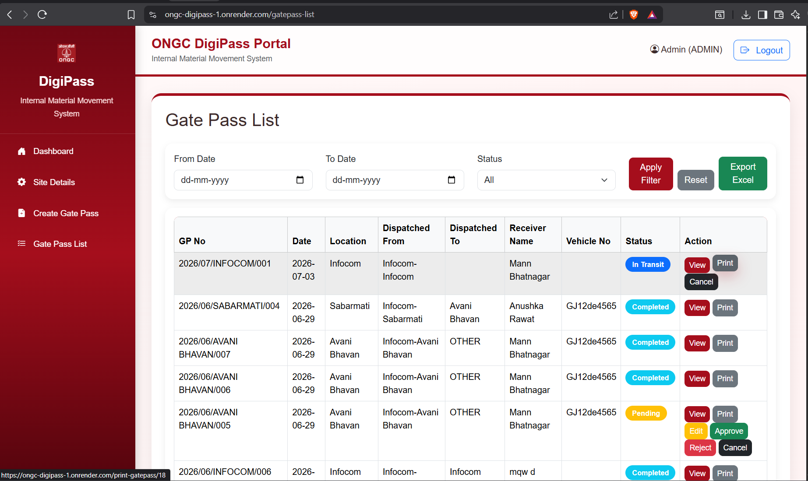
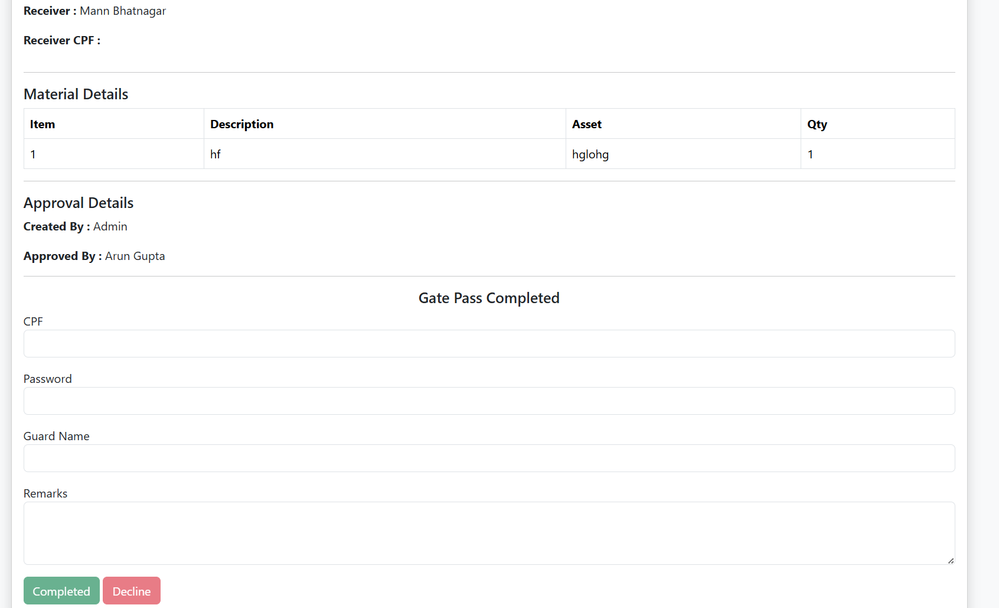
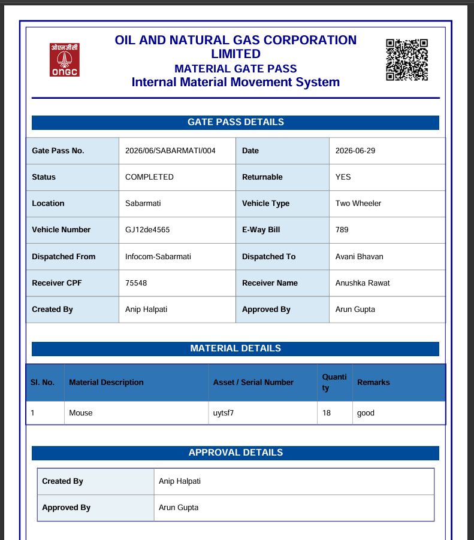

# ONGC DigiPass Portal


---

## ONGC DigiPass Portal

**ONGC DigiPass Portal** is a full-stack web application developed during my internship at **Oil and Natural Gas Corporation (ONGC)** for digitizing the internal material movement process.

The application replaces the traditional paper-based gate pass system with a secure digital workflow featuring role-based authentication, approval management, QR-code verification, PDF generation, Excel export, and complete movement tracking.

---

# Live Demo

https://ongc-digipass-1.onrender.com

---

# Features

- Secure Login System
- Role-Based Authentication
- Dashboard Analytics
- Gate Pass Creation
- Dynamic Material Entry
- Gate Pass Approval
- QR Code Generation
- Security Verification
- Returnable & Non-Returnable Gate Pass Workflow
- PDF Gate Pass Generation
- Excel Report Export
- Search & Filter Gate Passes
- Complete Audit Trail

---

# Technology Stack

| Category | Technology |
|-----------|------------|
| Backend | Python |
| Framework | Flask |
| ORM | SQLAlchemy |
| Database | MySQL |
| Frontend | HTML, CSS, Bootstrap 5, Jinja2 |
| Authentication | Flask-Login, Session Management |
| QR Code | qrcode |
| PDF Generation | ReportLab |
| Excel Export | OpenPyXL |
| Version Control | Git, GitHub |

---

# Application Screenshots

## Login Page

Displays the secure authentication page for ONGC employees.



---

## Dashboard

Shows overall gate pass statistics along with quick actions for administrators.



---

## Create Gate Pass

The system allows users to create digital material gate passes.



---

## Material Details

Supports multiple material entries with quantity, asset number, remarks and dynamic row addition.



---

## Site Details

Displays location-wise statistics including total, pending, approved and rejected gate passes.



---

## Gate Pass List

Users can search, filter, print, approve, reject and export gate passes.



---

## Security Verification

Security personnel verify QR codes and update movement status during Check-In and Check-Out.



---

## Generated PDF

Professional PDF Gate Pass generated automatically after approval.



---

# User Roles

## User

- Login
- Create Gate Pass
- Edit Gate Pass
- View Gate Pass
- Print Gate Pass

---

## Approving Authority

- Approve Gate Pass
- Reject Gate Pass
- View Gate Pass Details

---

## Security

- Scan QR Code
- Verify Credentials
- Check-Out Material
- Check-In Material
- Add Guard Details
- Add Remarks

---

# Workflow

```text
Login
   │
   ▼
Create Gate Pass
   │
   ▼
Add Material Details
   │
   ▼
Submit
   │
   ▼
Approval
   │
   ▼
QR Code Generated
   │
   ▼
Security Verification
   │
   ▼
Completed
```

---

# Non-Returnable Workflow

```text
PENDING
    │
    ▼
APPROVED
    │
    ▼
CHECK-OUT
    │
    ▼
IN TRANSIT
    │
    ▼
CHECK-IN
    │
    ▼
COMPLETED
```

---

# Returnable Workflow

```text
PENDING
      │
      ▼
APPROVED
      │
      ▼
FIRST CHECK-OUT
      │
      ▼
FIRST CHECK-IN
      │
      ▼
SECOND CHECK-OUT
      │
      ▼
SECOND CHECK-IN
      │
      ▼
COMPLETED
```

---

# Database Design

## GatePass

Stores

- Gate Pass Number
- Status
- Vehicle Details
- Receiver Details
- Approval Details
- Returnable Status
- Security Information
- Movement History

---

## GatePassItem

Stores

- Item Number
- Material Description
- Asset / Serial Number
- Census Number
- Quantity
- Remarks

---

# Validation

- Mandatory Gate Pass Details
- At least one material item required
- Unique Gate Pass Number
- Role-based Authorization
- Security Authentication
- Completed Gate Passes cannot be modified

---

# Major Functionalities

✔ User Authentication

✔ Session Management

✔ QR Code Generation

✔ QR Verification

✔ Dynamic Material Management

✔ PDF Generation

✔ Excel Export

✔ Dashboard Analytics

✔ Search & Filter

✔ Audit Trail

✔ Role-Based Access Control

✔ Responsive User Interface

---

# Repository Structure

```text
ONGC-Digital-Pass-System
│
├── app.py
├── config/
├── models/
├── routes/
├── templates/
├── static/
│   ├── css/
│   ├── js/
│   ├── images/
│
├── reports/
├── screenshots/
│   ├── login.png
│   ├── dashboard.png
│   ├── create_gatepass_1.png
│   ├── create_gatepass_2.png
│   ├── site_details.png
│   ├── gatepass_list.png
│   ├── security_verification.png
│   └── generated_pdf.png
│
├── requirements.txt
└── README.md
```

---

# Installation

```bash
git clone https://github.com/mann256/ONGC-Digital-Pass-System.git

cd ONGC-Digital-Pass-System

pip install -r requirements.txt

python app.py
```

---

# Future Enhancements

- Email Notifications
- SMS Alerts
- Mobile Application
- Barcode Support
- Digital Signature
- Dashboard Charts
- Multi-Department Support
- Approval History
- Notification Center

---

# Skills Demonstrated

- Full Stack Web Development
- Flask Development
- MySQL Database Design
- SQLAlchemy ORM
- RESTful Routing
- Authentication & Session Management
- QR Code Integration
- PDF Report Generation
- Excel Report Export
- Bootstrap UI Development
- Software Testing
- Role-Based Authorization
- Enterprise Workflow Design

---

# Acknowledgements

Developed during my internship at

**Oil and Natural Gas Corporation (ONGC)**

Ahmedabad Asset

Security Services Department

---

# Author

**Mann Bhatnagar**

GitHub: https://github.com/mann256

LinkedIn: https://linkedin.com/in/mann-bhatnagar-49ab22333